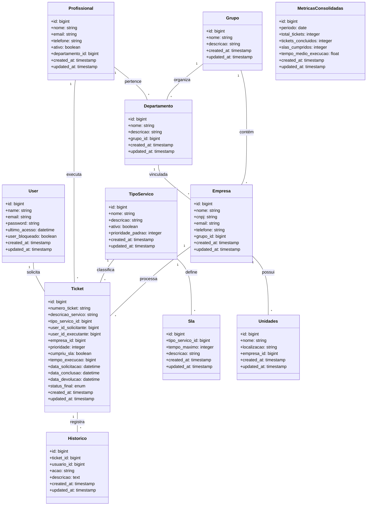
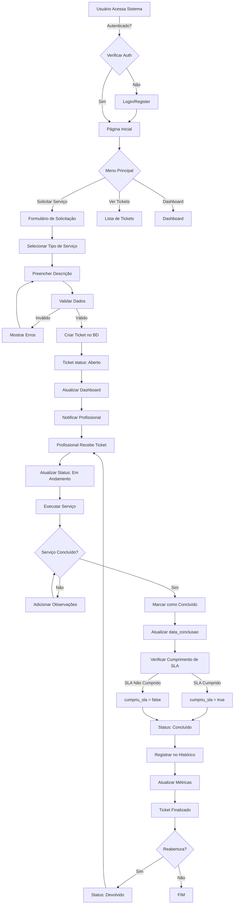
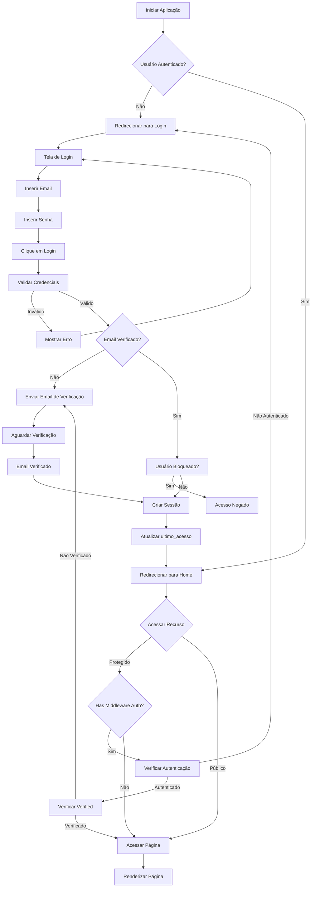
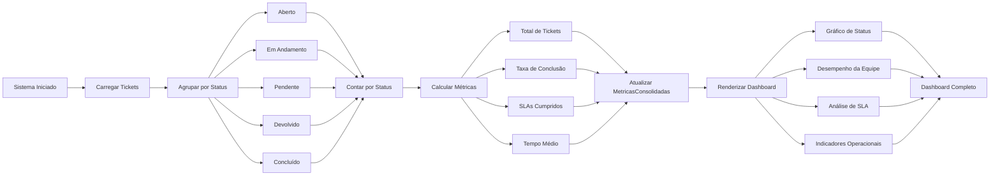
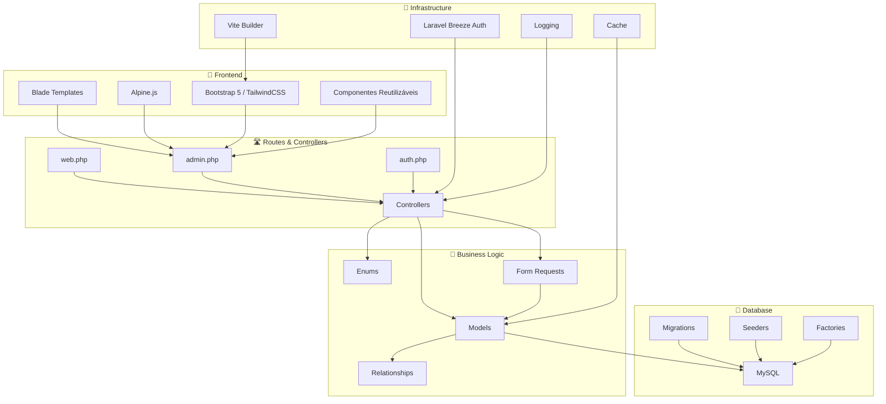

# MedTickets - Central de Agendamento de Solicitações de Serviços

## Resumo Executivo

**MedTickets** é um sistema web de gerenciamento de tickets e solicitação de serviços desenvolvido em **Laravel** com interface em **Blade PHP** e **TailwindCSS/Bootstrap 5**. O sistema permite que empresas gerenciem solicitações de serviços, acompanhem tickets, gerenciem profissionais, departamentos e cumpram SLAs.

---

## 1. Visão Geral da Arquitetura

### Stack Tecnológico

- **Backend:** Laravel 11 (PHP)
- **Frontend:** Blade PHP, TailwindCSS, Bootstrap 5, Alpine.js
- **Build Tool:** Vite
- **Banco de Dados:** MySQL
- **Autenticação:** Laravel Breeze
- **Testing:** Pest PHP

### Estrutura do Projeto

```
medTickets/
├── app/                      # Código da aplicação
│   ├── Http/Controllers/      # Controladores da aplicação
│   ├── Models/                # Modelos Eloquent
│   ├── Enums/                 # Enumerações
│   └── View/Components/       # Componentes Vue/Blade
├── resources/
│   ├── views/                 # Templates Blade
│   ├── js/                    # JavaScript e Alpine.js
│   └── css/                   # Estilos e TailwindCSS
├── routes/                    # Definição de rotas
├── database/
│   ├── migrations/            # Migrações do banco
│   ├── factories/             # Factories para testes
│   └── seeders/               # Seeders para dados iniciais
├── config/                    # Configurações da aplicação
├── public/                    # Arquivos públicos
└── storage/                   # Logs e arquivos gerados
```

## 2. Módulos Principais do Sistema

### 2.1 Gerenciamento de Usuários

**Funcionalidades:**
- Autenticação e autorização
- Criação, edição e bloqueio de usuários
- Rastreamento de último acesso (`ultimo_acesso`)
- Status de bloqueio (`user_bloqueado`)

**Arquivo Principal:** `app/Models/User.php`

**Migrations:** 
- `0001_01_01_000000_create_users_table.php`
- `0001_01_01_000003_update_users_table.php`

**Campos Principais:**
- `name` - Nome do usuário
- `email` - Email único
- `password` - Senha (hash)
- `ultimo_acesso` - Timestamp do último acesso
- `user_bloqueado` - Boolean para bloquear acesso


### 2.2 Gestão de Tickets

**Funcionalidades:**
- Criação de tickets de solicitação
- Atribuição de profissionais executantes
- Rastreamento de prioridade e SLA
- Histórico de mudanças
- Múltiplos status de ticket

**Arquivo Principal:** `app/Models/Ticket.php`

**Migration:** `2025_08_22_192103_create_tickets_table.php`

**Campos Principais:**
- `numero_ticket` - ID único do ticket (string)
- `descricao_servico` - Descrição do serviço solicitado
- `tipo_servico_id` - FK para tipo de serviço
- `user_id_solicitante` - FK para profissional que solicitou
- `user_id_executante` - FK para profissional que executa (nullable)
- `empresa_id` - FK para empresa
- `prioridade` - Nível de prioridade (1-5)
- `cumpriu_sla` - Boolean indicando cumprimento de SLA
- `tempo_execucao` - Tempo em execução (unsigned big integer)
- `data_solicitacao` - Quando foi solicitado
- `data_conclusao` - Quando foi concluído
- `data_devolucao` - Quando foi devolvido (se necessário)
- `status_final` - Status atual do ticket

**Status Disponíveis** (`app/Enums/StatusTickets.php`):
- `Aberto` - Azul (bg-info)
- `Em Andamento` - Amarelo (bg-warning)
- `Pendente` - Cinza (bg-secondary)
- `Devolvido` - Vermelho (bg-danger)
- `Concluído` - Verde (bg-success)

---

### 2.3 Gestão de Profissionais

**Funcionalidades:**
- Cadastro de profissionais
- Ativação/Desativação de profissionais
- Vinculação com departamentos
- Rastreamento de status

**Arquivo Principal:** `app/Models/Profissional.php`

**Migration:** `0001_01_01_205934_create_profissionals_table.php`

**Rota Especial:**
```php
Route::post('profissional/{profissional}/toggle', [ProfissionalController::class, 'toggle'])
    ->middleware(['auth', 'verified'])
    ->name('profissional.toggle');
```

---

### 2.4 Gestão de Departamentos

**Funcionalidades:**
- Cadastro de departamentos
- Vinculação com grupos empresariais
- Organização hierárquica

**Arquivo Principal:** `app/Models/Departamento.php`

**Migration:** `0001_01_01_205937_create_departamento_table.php`

---

### 2.5 Gestão de Empresas e Grupos

**Funcionalidades:**
- Cadastro de empresas
- Criação de grupos empresariais
- Vinculação hierárquica (empresa → grupo)

**Arquivos Principais:**
- `app/Models/Empresa.php`
- `app/Models/Grupo.php`

**Migrations:**
- `0001_01_01_205935_create_grupo_empresarial_table.php`
- `2025_08_18_211116_create_empresas_table.php`

**Rota Especial:**
```php
Route::get('/grupos/{grupo}/empresas', [GrupoController::class, 'empresas']);
```

---

### 2.6 Gestão de Tipos de Serviço

**Funcionalidades:**
- Cadastro de tipos de serviço
- Definição de SLAs por tipo
- Ativação/Desativação de tipos

**Arquivo Principal:** `app/Models/Tipo_servico.php`

**Migration:** `2025_08_22_191733_create_tipo_servicos_table.php`

---

### 2.7 Gestão de SLAs

**Funcionalidades:**
- Definição de SLAs por tipo de serviço
- Cálculo de cumprimento de prazos
- Rastreamento de violações

**Arquivo Principal:** `app/Models/Sla.php`

**Migration:** `2025_08_21_165905_create_slas_table.php`

---

### 2.8 Dashboard e Métricas

**Funcionalidades:**
- Dashboard operacional
- Desempenho de equipe
- Métricas consolidadas
- Visualização de SLAs

**Arquivos Principais:**
- `app/Models/Dashboard.php`
- `app/Models/MetricasConsolidadas.php`
- `app/Http/Controllers/DashboardController.php`
- `app/Http/Controllers/MetricasConsolidadasController.php`

**Views:**
- `resources/views/dashboard/operacional.blade.php`
- `resources/views/dashboard/desempenhoEquipe.blade.php`
- `resources/views/dashboard/sla.blade.php`

**Migration:** `2025_11_10_152615_create_metricas_consolidadas_tables.php`

---

### 2.9 Gestão de Histórico

**Funcionalidades:**
- Rastreamento de mudanças nos tickets
- Auditoria de ações
- Histórico de alterações

**Arquivo Principal:** `app/Models/Historico.php`

---

### 2.10 Solicitação de Serviços

**Funcionalidades:**
- Interface para solicitação de novos serviços
- Seleção de tipo de serviço
- Formulário de descrição e detalhes

**Arquivo Principal:** `app/Http/Controllers/SolicitaServicoController.php`

---

### 2.11 Gestão de Unidades

**Funcionalidades:**
- Cadastro de unidades
- Organização física/administrativa

**Arquivo Principal:** `app/Models/Unidades.php`

---

## 3. Enumerações (Enums)

O sistema utiliza enumerações para padronizar valores:

### `app/Enums/StatusTickets.php`
- Aberto
- EmAndamento
- Pendente
- Devolvido
- Concluido

Cada status possui uma classe Bootstrap para estilização automática.

### `app/Enums/Prioridad.php`
- Definição de níveis de prioridade

### `app/Enums/QuemSolicita.php`
- Tipos de solicitantes

### `app/Enums/TipoAcesso.php`
- Níveis de acesso/permissões

### `app/Enums/TipoUsuario.php`
- Tipos de usuários (admin, profissional, etc.)

---

## 4. Rotas da Aplicação

### Autenticação
- Arquivo: `routes/auth.php`
- Controlador: `App\Http\Controllers\Auth\*`

### Web
- Arquivo: `routes/web.php`
- Home: `GET /` (requer autenticação)

### Admin
- Arquivo: `routes/admin.php`
- Rotas administrativas

### Recursos RESTful
Todos os seguintes recursos possuem as 7 rotas padrão RESTful (index, create, store, show, edit, update, destroy):

```php
// Perfil do Usuário
Route::get('/profile/index', [ProfileController::class, 'index'])->name('profile.index');
Route::get('/profile/show', [ProfileController::class, 'show'])->name('profile.show');
Route::post('/profile/store', [ProfileController::class, 'store'])->name('profile.store');
Route::get('/profile/edit', [ProfileController::class, 'edit'])->name('profile.edit');
Route::patch('/profile', [ProfileController::class, 'update'])->name('profile.update');
Route::delete('/profile', [ProfileController::class, 'destroy'])->name('profile.destroy');

// Recursos
Route::resource('empresa', EmpresaController::class);
Route::resource('grupo', GrupoController::class);
Route::resource('profissional', ProfissionalController::class);
Route::resource('departamento', DepartamentoController::class);
Route::resource('tipo_servico', TipoServicoController::class);
```

### Rotas Personalizadas
```php
// Toggle status profissional
Route::post('profissional/{profissional}/toggle', [ProfissionalController::class, 'toggle'])
    ->name('profissional.toggle');

// Obter empresas de um grupo
Route::get('/grupos/{grupo}/empresas', [GrupoController::class, 'empresas']);
```

---

## 5. Estrutura de Componentes e Views

### Componentes Reutilizáveis (`resources/views/components/`)

- **alertas.blade.php** - Componente de alertas
- **modal.blade.php** - Modal reutilizável
- **input-label.blade.php** - Label de input
- **text-input.blade.php** - Campo de texto
- **primary-button.blade.php** - Botão primário
- **secondary-button.blade.php** - Botão secundário
- **danger-button.blade.php** - Botão de perigo
- **dropdown.blade.php** - Menu dropdown
- **nav-link.blade.php** - Link de navegação
- **ticket-header.blade.php** - Header de ticket
- **list-header.blade.php** - Header de lista

### Layouts (`resources/views/layouts/`)

- **app.blade.php** - Layout principal autenticado
- **guest.blade.php** - Layout para não autenticados
- **navigation.blade.php** - Navegação principal

### Páginas Principais

- **dashboard2.blade.php** - Dashboard principal
- **home.blade.php** - Página inicial

### Módulos de Views

#### Autenticação (`resources/views/auth/`)
- login.blade.php
- register.blade.php
- forgot-password.blade.php
- reset-password.blade.php
- verify-email.blade.php
- update-password.blade.php
- confirm-password.blade.php

#### CRUD Módulos (`resources/views/{modulo}/`)
Cada módulo possui:
- **index.blade.php** - Lista de registros
- **createModal.blade.php** - Modal de criação
- **updateModal.blade.php** - Modal de edição
- **deleteModal.blade.php** - Modal de exclusão
- **statusModal.blade.php** - Modal de status (quando aplicável)
- **visualisarDadosModal.blade.php** - Modal de visualização

Módulos com views CRUD:
- departamento
- empresa
- grupo
- profissional
- solicitaServico
- ticket
- tipoServico
- user

#### Dashboard (`resources/views/dashboard/`)
- operacional.blade.php
- desempenhoEquipe.blade.php
- sla.blade.php

#### Perfil (`resources/views/profile/`)
- index.blade.php
- create.blade.php
- edit.blade.php
- userprofile.blade.php
- registerBreeze.blade.php
- partials/delete-user-form.blade.php
- partials/update-password-form.blade.php
- partials/update-profile-information-form.blade.php

---

## 6. Banco de Dados

### Migrações Principais

1. **Users** - `0001_01_01_000000_create_users_table.php`
   - Usuários do sistema com autenticação

2. **Cache** - `0001_01_01_000001_create_cache_table.php`
   - Cache do Laravel

3. **Jobs** - `0001_01_01_000002_create_jobs_table.php`
   - Fila de jobs

4. **Profissionais** - `0001_01_01_205934_create_profissionals_table.php`
   - Profissionais do sistema

5. **Grupo Empresarial** - `0001_01_01_205935_create_grupo_empresarial_table.php`
   - Grupos de empresas

6. **Departamentos** - `0001_01_01_205937_create_departamento_table.php`
   - Departamentos

7. **Empresas** - `2025_08_18_211116_create_empresas_table.php`
   - Cadastro de empresas

8. **SLAs** - `2025_08_21_165905_create_slas_table.php`
   - Definição de prazos/SLAs

9. **Tipos de Serviço** - `2025_08_22_191733_create_tipo_servicos_table.php`
   - Tipos de serviços disponíveis

10. **Tickets** - `2025_08_22_192103_create_tickets_table.php`
    - Tickets de solicitação

11. **Relações Circulares** - `2025_10_20_120749_add_circular_relations_to_tables.php`
    - Relações bidirecionais entre entidades

12. **Métricas Consolidadas** - `2025_11_10_152615_create_metricas_consolidadas_tables.php`
    - Tabelas de métricas e consolidações

### Factories (para testes)

- `DepartamentoFactory.php`
- `EmpresaFactory.php`
- `ProfissionalFactory.php`
- `TicketFactory.php`
- `UserFactory.php`

### Seeders (dados iniciais)

- `DatabaseSeeder.php`
- `DepartamentoSeeder.php`
- `EmpresaSeeder.php`
- `GrupoSeeder.php`
- `ProfissionalSeeder.php`
- `SlaSeeder.php`
- `TicketSeeder.php`
- `TipoServicosTableSeeder.php`
- `UserSeeder.php`

---

## 7. Frontend

### Dependências JS/CSS

```json
{
  "devDependencies": {
    "vite": "^7.1.6",
    "laravel-vite-plugin": "^2.0.1",
    "alpinejs": "^3.4.2",
    "axios": "^1.11.0",
    "tailwindcss": "^4.1.13",
    "autoprefixer": "^10.4.21"
  },
  "dependencies": {
    "bootstrap": "^5.3.7",
    "bootstrap-icons": "^1.13.1",
    "material-icons": "^1.13.14"
  }
}
```

### Arquivos CSS

- **app.css** - Estilos globais
- **style.css** - Estilos adicionais

### Arquivos JavaScript

- **app.js** - Configuração principal
- **bootstrap.js** - Inicialização do Alpine.js
- **main.js** - Funções principais
- **global-function.js** - Funções globais
- **não_utilizar.js** - Código descontinuado (não remover ainda)

### Build Tool

**Vite** configurado para:
- HMR (Hot Module Replacement) em desenvolvimento
- Minificação em produção
- Bundling eficiente

---

## 8. Controladores Principais

### `HomeController`
- Página inicial da aplicação

### `DashboardController`
- Dashboard operacional

### `MetricasConsolidadasController`
- Métricas e relatórios consolidados

### `EmpresaController`
- CRUD de empresas

### `GrupoController`
- CRUD de grupos empresariais
- Obtenção de empresas por grupo

### `ProfissionalController`
- CRUD de profissionais
- Toggle de status (ativado/desativado)

### `DepartamentoController`
- CRUD de departamentos

### `TicketsController`
- CRUD de tickets
- Resolução de tickets

### `TipoServicoController`
- CRUD de tipos de serviço
- Ativação/Desativação

### `SlaController`
- CRUD de SLAs

### `SolicitaServicoController`
- Solicitação de novos serviços

### `HistoricoController`
- Visualização de histórico

### `UnidadesController`
- CRUD de unidades

### `ProfileController`
- Gerenciamento de perfil do usuário
- Criação de novos usuários
- Edição de dados

---

## 9. Autenticação e Autorização

### Laravel Breeze
O sistema utiliza **Laravel Breeze** para autenticação.

### Middleware
- `auth` - Requer autenticação
- `verified` - Requer email verificado
- `auth:sanctum` - Para API (se utilizada)

### Controllers de Autenticação
- `AuthenticatedSessionController`
- `ConfirmablePasswordController`
- `EmailVerificationNotificationController`
- `EmailVerificationPromptController`
- `NewPasswordController`
- `PasswordController`
- `PasswordResetLinkController`
- `RegisteredUserController`
- `VerifyEmailController`

---

## 10. Configuração

### Arquivo Principal: `config/app.php`
Configurações gerais da aplicação

### Arquivo Customizado: `config/adminpanel.php`
Configurações específicas do painel administrativo (menu, permissões, etc.)

### Arquivo de Sessão: `config/session.php`
Configurações de sessão

### Arquivo de Cache: `config/cache.php`
Configurações de cache

### Arquivo de Banco: `config/database.php`
Configurações de conexão MySQL

---

## 11. Padrões de Desenvolvimento

### Criar um novo CRUD

1. **Criar o Model** (com migration e controller):
```bash
php artisan make:model NomeDaClass -mcr
```

2. **Criar a pasta de views:**
```
resources/views/nomedaclass/
├── index.blade.php
├── createModal.blade.php
├── updateModal.blade.php
└── deleteModal.blade.php
```

3. **Adicionar a rota** em `routes/web.php` ou `routes/admin.php`:
```php
Route::resource('nomedaclass', NomeDaClassController::class)
    ->middleware(['auth', 'verified']);
```

4. **Adicionar ao menu** em `config/adminpanel.php`

5. **Testar no navegador**

6. **Implementar lógica no Controller** para enviar dados à view

### Padrão de Modal
- Todos os formulários utilizam modais Bootstrap
- Componente base: `components/modal.blade.php`
- Nomes padronizados: `createModal.blade.php`, `updateModal.blade.php`, `deleteModal.blade.php`

### Padrão de Status
- Utilizar Enums para status
- Aplicar estilo Bootstrap automático via enum
- Exemplo: `StatusTickets::Aberto->getBootstrapClass()`

---

## 12. Principais Documentos do Projeto

O projeto possui documentação adicional em `docs/`:

- **comandos.md** - Comandos artisan úteis
- **crud.md** - Guia para criar CRUDs
- **docsDiversos.md** - Documentação diversa
- **filtro_Select.md** - Implementação de filtros
- **informaçãoDoStyle.md** - Informações sobre estilos
- **modais.md** - Documentação de modais
- **slides.md** - Documentação de carrosséis
- **tickets_Resolver.md** - Específico para resolução de tickets

---

## 13. Dependências Externas

### Backend
- **Laravel 11** - Framework PHP
- **Eloquent ORM** - Mapeamento objeto-relacional
- **Laravel Breeze** - Autenticação
- **Pest PHP** - Framework de testes

### Frontend
- **Bootstrap 5** - Framework CSS
- **TailwindCSS** - Utilitários CSS
- **Alpine.js** - Interatividade
- **Axios** - HTTP client
- **Vite** - Build tool

---

## 14. Fluxo de Dados Principal

### Criação de Ticket

1. Usuário acessa formulário de solicitação
2. Preenche informações (tipo de serviço, descrição, etc.)
3. Sistema valida dados via FormRequest
4. Ticket é criado no banco com status "Aberto"
5. Ticket aparece no dashboard
6. Profissional designado recebe notificação
7. Profissional atualiza status para "Em Andamento"
8. Profissional marca como "Concluído"
9. Sistema verifica cumprimento de SLA
10. Histórico é registrado

### Dashboard

1. Carrega métricas consolidadas
2. Exibe tickets por status
3. Mostra desempenho da equipe
4. Monitora SLAs
5. Visualiza operacional

---

## 15. Segurança

### Medidas Implementadas

- **Autenticação** - Laravel Breeze com email verification
- **Autorização** - Middleware auth e verified
- **Bloqueio de Usuários** - Campo `user_bloqueado`
- **Hash de Senhas** - Usando Laravel's hashing
- **CSRF Protection** - Nativa do Laravel
- **SQL Injection** - Prevenido via Eloquent ORM

---

## 16. Performance

### Otimizações

- **Cache** - Utiliza Laravel Cache
- **Vite** - Build otimizado para produção
- **Database Indexes** - Índices em colunas principais (ex: `numero_ticket`)
- **Eager Loading** - Relações entre modelos
- **Seeders** - Dados iniciais para testes

---

## 17. Roteiros Futuros

Possíveis melhorias e expansões:

- [ ] API RESTful completa
- [ ] Sistema de notificações em tempo real (WebSockets)
- [ ] Exportação de relatórios (PDF/Excel)
- [ ] Mobile app
- [ ] Sistema de chat/comentários em tickets
- [ ] Integrações com sistemas externos
- [ ] Automações de workflow
- [ ] Sistema de permissões granulares (RBAC)

---

## 18. Troubleshooting e Comandos Úteis

### Setup Inicial

```bash
# Instalar dependências
composer install
npm install

# Copiar arquivo de ambiente
cp .env.example .env

# Gerar chave de aplicação
php artisan key:generate

# Executar migrações
php artisan migrate

# Executar seeders
php artisan db:seed

# Construir assets
npm run build
```

### Desenvolvimento

```bash
# Servidor Laravel
php artisan serve

# Build em desenvolvimento (HMR)
npm run dev

# Build para produção
npm run build

# Executar testes
./vendor/bin/pest

# Clear cache
php artisan cache:clear
php artisan config:clear
php artisan view:clear
```

### Criar Novos Recursos

```bash
# Criar Model, Migration, Factory e Controller
php artisan make:model NomeDaClass -mcr

# Apenas criar Controller
php artisan make:controller NomeDoController

# Apenas criar Migration
php artisan make:migration create_nome_table

# Apenas criar Seeder
php artisan make:seeder NomeSeeder
```

---

## 19. Diagramas do Sistema

### 19.1 Diagrama de Classes (Modelo de Dados)



### 19.2 Fluxograma de Criação e Resolução de Ticket



### 19.3 Fluxograma de Autenticação e Autorização



### 19.4 Fluxograma de Gestão de Dashboard e Métricas



### 19.5 Arquitetura em Camadas



---

## 20. Contato e Suporte

- **Repositório:** medTickets (joabdevelop)
- **Branch Atual:** main
- **Última Atualização:** 25 de novembro de 2025

---

**Fim da Documentação**
